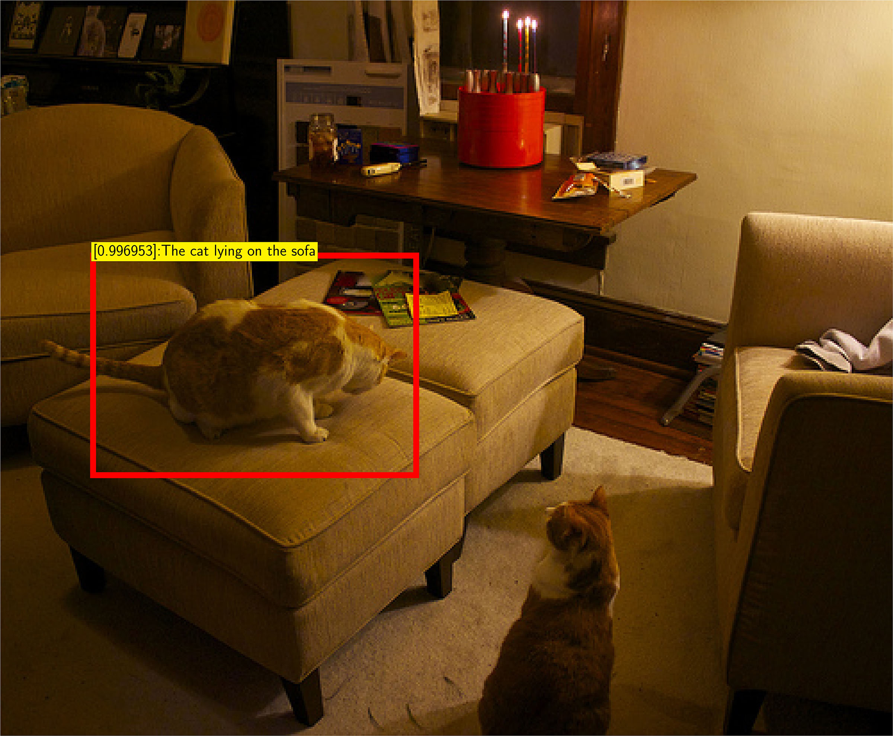
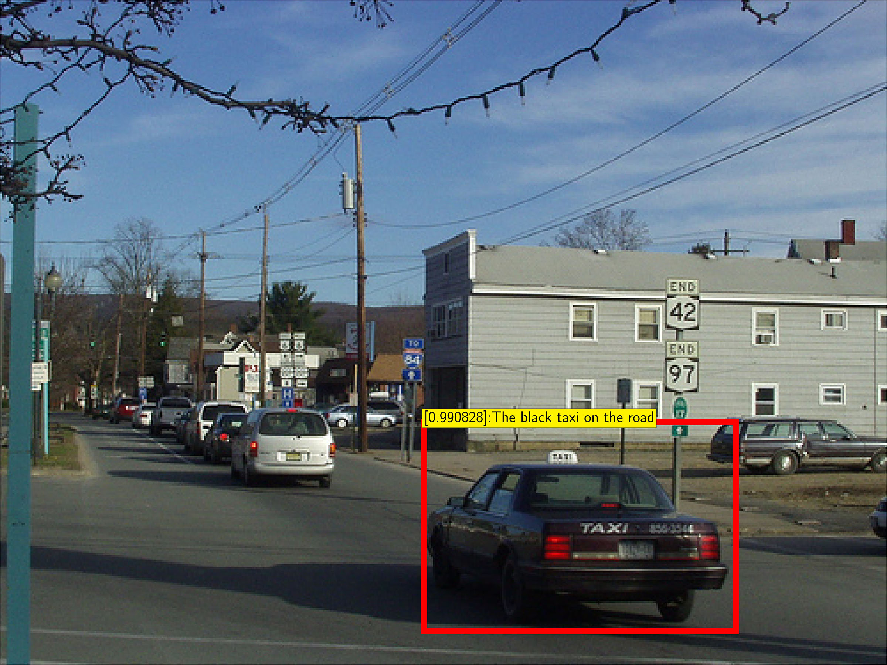

# TensorFlow Implementation of DBNet

This repository is the **TensorFlow** implementation of DBNet, a method for localizing and detecting visual entities with natural language queries. DBNet is proposed in the follow paper:

**[Discriminative Bimodal Networks for Visual Localization and Detection with Natural Language Queries](https://arxiv.org/abs/1704.03944)**,  
[Yuting Zhang](http://www.ytzhang.net/), Luyao Yuan, Yijie Guo, Zhiyuan He, I-An Huang, [Honglak Lee](https://web.eecs.umich.edu/~honglak/index.html)  
In *IEEE Conference on Computer Vision and Pattern Recognition (CVPR)*, 2017. **spotlight**

Remarks: 

- The results in the above paper are obtained with the Caffe+MATLAB implementation, which is available at https://github.com/YutingZhang/dbnet-caffe-matlab
- This repository uses the evaluation protocol published together with the above paper, the implementation of which is at https://github.com/YutingZhang/nlvd_evaluation . It has been included here as a git submodule (see below for instructions on cloning submodules). 

## How to clone this repository

**This GIT repository have submodules**, please use the follow command to clone it.

	git clone git clone --recursive https://github.com/yuanluya/nldet_TensorFlow

If you have clone the repository without the `--recursive` flag, you can do `git submodule update --init --recursive` in your local repository folder.

The evaluation submodule requires additional setup steps. Please refer to [`./nlvd_evaluation/README.md`] (https://github.com/YutingZhang/nlvd_evaluation)

## Detection examples

Here are two detection examples:

## Introduction to DBNet

DBNet is a two-pathway deep neural network framework. It uses two separate pathways to extract visual and linguistic features, and uses a discriminative network to compute the matching score between the image region and the text phrase. DBNet is trained with a classifier with extensive use of negative samples. The training objective encourages better localization on single images, incorporates text phrases in a broad range, and properly pairs image regions with text phrases into positive and negative examples.

For more details about DBNet, please refer to [the paper](https://arxiv.org/abs/1704.03944).

## Prerequisites

* Python 3.3+
* [TensorFlow](https://www.TensorFlow.org/install/install_linux) 1.x: `pip3 install --user TensorFlow-gpu`
* Python-OpenCV 3.2.0: `pip3 install --user opencv-python`
* [Pyx 0.14.1](http://pyx.sourceforge.net/): `pip3 install --user pyx`
* [PIL 4.0.0](http://pillow.readthedocs.io/en/3.4.x/index.html): `pip3 install --user Pillow`

If you have admin/root access to your workstation, you can remove `--user` and use `sudo` to install them into the system folder.

## What are included

- Demo using pretrained models (detection and visualization on individual images)
- Training code
- Evaluation code

## Data to download

- The [Visual Genome Images](http://visualgenome.org/api/v0/api_home.html) dataset.
- [Spell-corrected text annotations](http://www.ytzhang.net/files/dbnet/data/vg_v1_json.tar.gz) for Visual Genome.

- *Remark:* if you have set up the evaluation toolbox in `./nlvd_evaluation`, the above data should have been available already. You will only need to update the data paths in the configure file.

- [Cached EdgeBoxes](http://www.ytzhang.net/files/dbnet/data/vg-v1-edgebox.tar.gz) for the Visual Genome images

## Pretrained Models

- a VGGNet-16 faster RCNN model pretrained on PASCAL VOC
- Our pretrained VGGNet-16 based DBNet model.
- We plan to release the pretrained models based on ResNet-101. 

The VGGNet-16 based model can be obtained via [this link](http://www.ytzhang.net/files/dbnet/tensorflow/dbnet-vgg-pretrained.tar.gz). This model was trained according to the following procedure from scratch. It outperforms the model used in the paper slightly. Its evaluation results are summarized as follows.

- Localization

| IoU Threshold| 0.1 | 0.2 | 0.3 | 0.4 | 0.5 | 0.6 | 0.7 |
| --- | --- | --- | --- | --- | --- | --- | --- |
| Recall | 56.6 | 47.8 | 40.1 | 32.4 | 25.0| 17.6 | 10.7 |

|Top Overlap Median | Top Overlap Mean |
| --- | --- |
| 0.174 | 0.270 |

- Detection for the level-0 query set: 

|Threshold | gAP | mAP |
| --- | --- | --- |
| 0.3 | 25.3 | 49.8 | 
| 0.5 | 12.3 | 31.4 |
| 0.7 | 2.6 | 12.4 |

- Detection for the level-1 query set: 

|Threshold | gAP | mAP |
| --- | --- | --- |
| 0.3 | 22.8 | 46.7 | 
| 0.5 | 11.2 | 29.7 |
| 0.7 | 2.4 | 12.0 |

- Detection for the level-2 query set: 

|Threshold | gAP | mAP |
| --- | --- | --- |
| 0.3 | 9.6 | 28.4 | 
| 0.5 | 5.0 | 19.0 |
| 0.7 | 1.2 | 8.2 |

## Code Overview

- `main.py`:   contains the main function to run the experiment and evaluate the model.
- `test.py`:   utilities for the test phase
- `utils.py`:  utility functions to read in data to neural networks.
- `config.py`: definitions of the model hyperparameters, and  training and testing configurations.
- `networks`:  the subfolder for the model files.

## Usage

You can use `python3 main.py` to run our code with default config setting, see `config.py` for detailed configuration definitions. You can overwrite the default configuration in `config.py` by parsing the corresponding arguments to `main.py` (see the examples later in this section).

### Detecting and Visualizing on Sample Images

#### Demo on Images from Visual Genome (Quick Demo)

You can run a quick demo on Visual Genome images with a user-specified query.

- Download the Visual Genome images, text annotations, EdgeBox cache, and our pretrained model.
- Set up the `ENV_PATHS.IMAGE_PATH` and `ENV_PATHS.IMAGE_PATH` accordingly in `config.py`.
- Put the pretrained model in the same directory as defined in `config.py`.
- Create a json file with a list of image ids (just the number) that you want to do detection with and set the `--IMAGE_LIST_DIR` in `config.py` to this file's directory.
- After that, run
	
		python3 main.py --MODE vis --PHRASE_INPUT 'your text query .'
	
- You should be able to view the visualization of the detection results in the `visualization` folder created under the root of the project.  
- Make sure you have [Pyx](http://pyx.sourceforge.net/) and [PIL](http://pillow.readthedocs.io/en/3.4.x/index.html) installed to draw the result. `pdflatex` is also needed.

#### Demo on Other Images

To perform detection on non-Visual-Genome images, an external region proposal method is needed. Our code supports EdgeBox. You can download [the EdgeBox python interface](https://github.com/dculibrk/edge_boxes_with_python) to the repository root and run our code. Please make sure that the `ENV_PATHS.EDGE_BOX_RPN` is pointing to location of `edge_boxes.py`. The test procedure is the same as testing on Visual Genome images, except that, you will need to use **absolute paths** in the json file rather than image ids to list the test images.

### Training DBNet

1. Download images from [the Visual Genome website](http://visualgenome.org/api/v0/api_home.html) and our spell-checked text annotations.
2. Change `config.py` according to your data paths.
3. Either download our [trained model](#pretrained-model) to finetuning or perform training from scratch.
4. To finetune a pretrained model, please download and make sure `config.py` has the correct paths to the two `.npy` files (one is for the image pathway, and the other one is for the text pathway). 

#### Training from Scratch

To train from scratch, we recommend using the [faster RCNN](https://arxiv.org/abs/1506.01497) to initialize the image pathway and randomly initialize the text pathway with our default parameters. After that, the DBNet model can be trained in 3 phases.

- Phase 1: Fix the image net and use the base learning rate for the text model until the loss converges. 

`python3 main.py --PHASE phase1 --text_lr 1e-4 --image_lr_conv 0 --image_lr_region 0 --IMAGE_FINE_TUNE_MODEL frcnn_Region_Feat_Net.npy --TEXT_FINE_TUNE_MODEL XXX.npy --MAX_ITERS 50000`

- Phase 2: Tune both pathway together without changing the base learning rate. To try out other configurations, change plese change `config.py`. 

`python3 main.py --PHASE phase2 --text_lr 1e-4 --image_lr_conv 1e-3 --image_lr_region 1e-3 --INIT_SNAPSHOT phase1 --INIT_ITER 50000 --MAX_ITERS 150000`

- Phase 3: Decrease the learning rate for all pathways by a factor of 10 and train the model further. 

`python3 main.py --PHASE phase3 --INIT_SNAPSHOT phase2 --INIT_ITER 200000 --MAX_ITERS 100000`

Model snapshots will be saved every `--SAVE_ITERS` to `--SNAPSHOT_DIR`. We name the snapshots as `nldet_[PHASE]_[ITER]`.

### Benchmarking on Visual Genome

To test with pretrained model, you can place `.npy` files to the default directory and run `python3 main.py --MODE test`. To test TensorFlow models trained from scratch, please change `--INIT_SNAPSHOT` and `--INIT_ITER` flags accordingly. 

The detection results will be saved in a subfolder `tmp_output` under the directory `nlvd_evaluation/results/vg_v1/dbnet_[IMAGE MODEL]/` in `nlvd_evaluation` submodule. `IMAGE MODEL` refers to the model used in the image path way and can be set by `--IMAGE_MODEL` flag in `config.py`. By default `--IMAGE_MODEL` is set to `vgg16` and our model also supports `resnet101`. These tempory results will be merged together and saved in a `.txt` file, which can be used by our evaluation code directly. As long as results in `tmp_output` are saved, testing process can be resumed at anytime. Change the `--LEVEL` flag in `config.py` to perform the three-level tests in the paper.

`python3 main.py --MODE test --LEVEL level_0 --INIT_SNAPSHOT phase3 --INIT_ITER 300000`

### Evaluation

The evaluation and dataset development code is cloned from the [nlvd_evaluation](https://github.com/YutingZhang/nlvd_evaluation) repository as a submodule of this code. You can refer to [this page](https://github.com/YutingZhang/nlvd_evaluation/tree/master/evaluation) for more detailed instructions for how to compute the performance metrics.

## Contributors

This repository is mainly contributed by [Luyao Yuan](https://github.com/yuanluya) and [Binghao Deng](https://github.com/bhdeng). The evaluation code is provided by [Yijie Guo](https://github.com/guoyijie)
